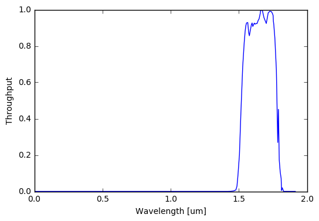
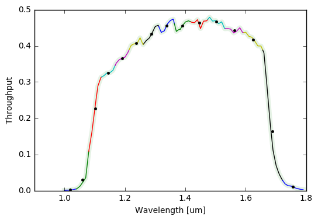
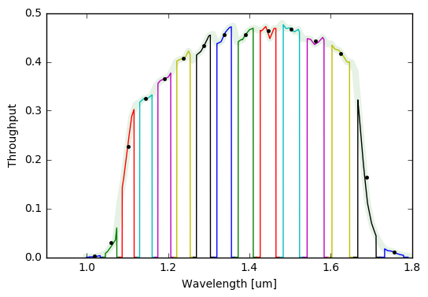
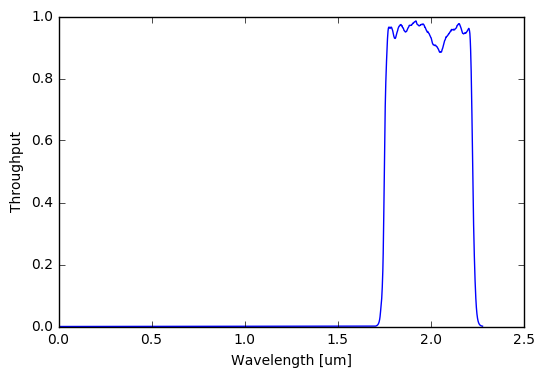

# Introduction

The [Spanish Virtual Observatory (SVO) Filter Profile Service](http://svo2.cab.inta-csic.es/theory/fps3/) is a great resource for homogenized photometric filter curves and metadata. With `svo_filters`, I tried to create a lightweight and flexible package to incorporate these filters into Python applications.

Install in the usual fashion with

```
cd svo_filters
python setup.py install
```

Then import like so


```python
from svo_filters import svo
```

The actual filters are stored locally as XML files and can be viewed with


```python
svo.filters()
```


&lt;Table masked=True length=17&gt;
<table id="table4531156752" class="table-striped table-bordered table-condensed">
<thead><tr><th>Band</th><th>CalibrationReference</th><th>FWHM</th><th>Facility</th><th>FilterProfileService</th><th>MagSys</th><th>PhotCalID</th><th>PhotSystem</th><th>ProfileReference</th><th>WavelengthCen</th><th>WavelengthEff</th><th>WavelengthMax</th><th>WavelengthMean</th><th>WavelengthMin</th><th>WavelengthPeak</th><th>WavelengthPhot</th><th>WavelengthPivot</th><th>WavelengthUCD</th><th>WavelengthUnit</th><th>WidthEff</th><th>ZeroPoint</th><th>ZeroPointType</th><th>ZeroPointUnit</th><th>filterID</th><th>n_bins</th><th>n_channels</th><th>path</th><th>refs</th><th>Instrument</th><th>DetectorType</th><th>Comments</th></tr></thead>
<thead><tr><th>str91</th><th>str86</th><th>str91</th><th>str91</th><th>str91</th><th>str91</th><th>str91</th><th>str91</th><th>str91</th><th>str91</th><th>str91</th><th>str91</th><th>str91</th><th>str91</th><th>str91</th><th>str91</th><th>str91</th><th>str91</th><th>str91</th><th>str91</th><th>str91</th><th>str91</th><th>str91</th><th>str91</th><th>str91</th><th>str91</th><th>str91</th><th>str91</th><th>str91</th><th>str86</th><th>str91</th></tr></thead>
<tr><td>2MASS.H</td><td>http://adsabs.harvard.edu/cgi-bin/nph-bib_query?bibcode=2003AJ....126.1090C&amp;db_key=AST</td><td>0.26096</td><td>2MASS</td><td>ivo://svo/fps</td><td>Vega</td><td>2MASS/2MASS.H/Vega</td><td>2MASS</td><td>http://www.ipac.caltech.edu/2mass/releases/allsky/doc/sec6_4a.html</td><td>1.64872</td><td>1.662</td><td>1.8231</td><td>1.662</td><td>1.47874</td><td>1.671</td><td>1.64238</td><td>1.64949</td><td>em.wl</td><td>um</td><td>0.25094</td><td>1024.0</td><td>Pogson</td><td>Jy</td><td>2MASS/2MASS.H</td><td>1</td><td>58</td><td>/Users/jfilippazzo/Documents/Modules/svo_filters/svo_filters/data/filters/2MASS.H</td><td>[&apos;AST&apos;]</td><td>--</td><td>--</td><td>--</td></tr>
<tr><td>2MASS.J</td><td>http://adsabs.harvard.edu/cgi-bin/nph-bib_query?bibcode=2003AJ....126.1090C</td><td>0.21491</td><td>2MASS</td><td>ivo://svo/fps</td><td>Vega</td><td>2MASS/2MASS.J/Vega</td><td>2MASS</td><td>http://www.ipac.caltech.edu/2mass/releases/allsky/doc/sec6_4a.html#rsr</td><td>1.23906</td><td>1.235</td><td>1.4068</td><td>1.235</td><td>1.08065</td><td>1.326</td><td>1.23209</td><td>1.23931</td><td>em.wl</td><td>um</td><td>0.16241</td><td>1594.0</td><td>Pogson</td><td>Jy</td><td>2MASS/2MASS.J</td><td>1</td><td>107</td><td>/Users/jfilippazzo/Documents/Modules/svo_filters/svo_filters/data/filters/2MASS.J</td><td>[&apos;2003AJ....126.1090C&apos;]</td><td>--</td><td>--</td><td>--</td></tr>
<tr><td>2MASS.Ks</td><td>http://adsabs.harvard.edu/cgi-bin/nph-bib_query?bibcode=2003AJ....126.1090C</td><td>0.27846</td><td>2MASS</td><td>ivo://svo/fps</td><td>Vega</td><td>2MASS/2MASS.Ks/Vega</td><td>2MASS</td><td>http://www.ipac.caltech.edu/2mass/releases/allsky/doc/sec6_4a.html#rsr</td><td>2.1634</td><td>2.159</td><td>2.35524</td><td>2.159</td><td>1.95437</td><td>2.263</td><td>2.15577</td><td>2.16386</td><td>em.wl</td><td>um</td><td>0.26189</td><td>666.8</td><td>Pogson</td><td>Jy</td><td>2MASS/2MASS.Ks</td><td>1</td><td>76</td><td>/Users/jfilippazzo/Documents/Modules/svo_filters/svo_filters/data/filters/2MASS.Ks</td><td>[&apos;2003AJ....126.1090C&apos;]</td><td>--</td><td>--</td><td>--</td></tr>
<tr><td>IRAC.I1</td><td>--</td><td>0.74317</td><td>Spitzer</td><td>ivo://svo/fps</td><td>Vega</td><td>Spitzer/IRAC.I1/Vega</td><td>IRAC</td><td>http://ssc.spitzer.caltech.edu/irac/spectral_response.html</td><td>3.54656</td><td>3.50751</td><td>3.96144</td><td>3.55726</td><td>3.12962</td><td>3.73052</td><td>3.52039</td><td>3.55079</td><td>em.wl</td><td>um</td><td>0.68362</td><td>277.222253517</td><td>Pogson</td><td>Jy</td><td>Spitzer/IRAC.I1</td><td>1</td><td>391</td><td>/Users/jfilippazzo/Documents/Modules/svo_filters/svo_filters/data/filters/IRAC.I1</td><td>[]</td><td>IRAC</td><td>--</td><td>--</td></tr>
<tr><td>IRAC.I2</td><td>--</td><td>1.00968</td><td>Spitzer</td><td>ivo://svo/fps</td><td>Vega</td><td>Spitzer/IRAC.I2/Vega</td><td>IRAC</td><td>http://ssc.spitzer.caltech.edu/irac/spectral_response.html</td><td>4.50243</td><td>4.43658</td><td>5.05606</td><td>4.50493</td><td>3.91733</td><td>4.43578</td><td>4.4543</td><td>4.49596</td><td>em.wl</td><td>um</td><td>0.86499</td><td>179.036636396</td><td>Pogson</td><td>Jy</td><td>Spitzer/IRAC.I2</td><td>1</td><td>401</td><td>/Users/jfilippazzo/Documents/Modules/svo_filters/svo_filters/data/filters/IRAC.I2</td><td>[]</td><td>IRAC</td><td>--</td><td>--</td></tr>
<tr><td>IRAC.I3</td><td>--</td><td>1.39119</td><td>Spitzer</td><td>ivo://svo/fps</td><td>Vega</td><td>Spitzer/IRAC.I3/Vega</td><td>IRAC</td><td>http://ssc.spitzer.caltech.edu/irac/spectral_response.html</td><td>5.71566</td><td>5.6281</td><td>6.50889</td><td>5.73857</td><td>4.89828</td><td>5.96712</td><td>5.65638</td><td>5.72446</td><td>em.wl</td><td>um</td><td>1.25612</td><td>113.848293842</td><td>Pogson</td><td>Jy</td><td>Spitzer/IRAC.I3</td><td>1</td><td>311</td><td>/Users/jfilippazzo/Documents/Modules/svo_filters/svo_filters/data/filters/IRAC.I3</td><td>[]</td><td>IRAC</td><td>--</td><td>--</td></tr>
<tr><td>IRAC.I4</td><td>--</td><td>2.83118</td><td>Spitzer</td><td>ivo://svo/fps</td><td>Vega</td><td>Spitzer/IRAC.I4/Vega</td><td>IRAC</td><td>http://ssc.spitzer.caltech.edu/irac/spectral_response.html</td><td>7.85565</td><td>7.58916</td><td>9.58759</td><td>7.92737</td><td>6.29938</td><td>8.45909</td><td>7.67414</td><td>7.88423</td><td>em.wl</td><td>um</td><td>2.52885</td><td>61.9973692512</td><td>Pogson</td><td>Jy</td><td>Spitzer/IRAC.I4</td><td>1</td><td>350</td><td>/Users/jfilippazzo/Documents/Modules/svo_filters/svo_filters/data/filters/IRAC.I4</td><td>[]</td><td>IRAC</td><td>--</td><td>--</td></tr>
<tr><td>Kepler.K</td><td>--</td><td>0.39934</td><td>Kepler</td><td>ivo://svo/fps</td><td>Vega</td><td>Kepler/Kepler.K/Vega</td><td>Kepler</td><td>http://keplergo.arc.nasa.gov/CalibrationResponse.shtml</td><td>0.63593</td><td>0.57813</td><td>0.90502</td><td>0.64168</td><td>0.41837</td><td>0.589</td><td>0.59823</td><td>0.63034</td><td>em.wl</td><td>um</td><td>0.35284</td><td>3033.0662326897</td><td>Pogson</td><td>Jy</td><td>Kepler/Kepler.K</td><td>1</td><td>623</td><td>/Users/jfilippazzo/Documents/Modules/svo_filters/svo_filters/data/filters/Kepler.K</td><td>[]</td><td>Kepler</td><td>--</td><td>--</td></tr>
<tr><td>NIRISS.F277W</td><td>--</td><td>0.73007</td><td>JWST</td><td>ivo://svo/fps</td><td>Vega</td><td>JWST/NIRISS.F277W/Vega</td><td>NIRISS</td><td>http://jwst.astro.umontreal.ca/?page_id=116</td><td>2.77775</td><td>2.72355</td><td>3.22972</td><td>2.78392</td><td>2.36989</td><td>2.902</td><td>2.73952</td><td>2.77579</td><td>em.wl</td><td>um</td><td>0.71526</td><td>430.62938035989</td><td>Pogson</td><td>Jy</td><td>JWST/NIRISS.F277W</td><td>1</td><td>933</td><td>/Users/jfilippazzo/Documents/Modules/svo_filters/svo_filters/data/filters/NIRISS.F277W</td><td>[]</td><td>NIRISS</td><td>1</td><td>--</td></tr>
<tr><td>WFC3_IR.G102</td><td>--</td><td>0.57288</td><td>HST</td><td>ivo://svo/fps</td><td>Vega</td><td>HST/WFC3_IR.G141/Vega</td><td>WFC3</td><td>http://www.stsci.edu/hst/wfc3/documents/handbooks/currentIHB/</td><td>1.38902</td><td>1.32829</td><td>1.77466</td><td>1.39879</td><td>1.04039</td><td>1.48039</td><td>1.3481</td><td>1.38869</td><td>em.wl</td><td>um</td><td>0.52172</td><td>1330.8028480785</td><td>Pogson</td><td>Jy</td><td>HST/WFC3_IR.G141</td><td>1</td><td>9512</td><td>/Users/jfilippazzo/Documents/Modules/svo_filters/svo_filters/data/filters/WFC3_IR.G102</td><td>[]</td><td>WFC3</td><td>--</td><td>/&gt;</td></tr>
<tr><td>WFC3_IR.G141</td><td>--</td><td>0.57288</td><td>HST</td><td>ivo://svo/fps</td><td>Vega</td><td>HST/WFC3_IR.G141/Vega</td><td>WFC3</td><td>http://www.stsci.edu/hst/wfc3/documents/handbooks/currentIHB/</td><td>1.38902</td><td>1.32829</td><td>1.77466</td><td>1.39879</td><td>1.04039</td><td>1.48039</td><td>1.3481</td><td>1.38869</td><td>em.wl</td><td>um</td><td>0.52172</td><td>1330.8028480785</td><td>Pogson</td><td>Jy</td><td>HST/WFC3_IR.G141</td><td>1</td><td>9512</td><td>/Users/jfilippazzo/Documents/Modules/svo_filters/svo_filters/data/filters/WFC3_IR.G141</td><td>[]</td><td>WFC3</td><td>--</td><td>/&gt;</td></tr>
<tr><td>WFC3_UVIS2.F814W</td><td>--</td><td>0.15047</td><td>HST</td><td>ivo://svo/fps</td><td>Vega</td><td>HST/WFC3_UVIS2.F814W/Vega</td><td>WFC3</td><td>http://www.stsci.edu/hst/wfc3/documents/handbooks/currentIHB/</td><td>0.78142</td><td>0.78961</td><td>0.96836</td><td>0.80527</td><td>0.69782</td><td>0.71331</td><td>0.795</td><td>0.8024</td><td>em.wl</td><td>um</td><td>0.15357</td><td>2440.7647763072</td><td>Pogson</td><td>Jy</td><td>HST/WFC3_UVIS2.F814W</td><td>1</td><td>1981</td><td>/Users/jfilippazzo/Documents/Modules/svo_filters/svo_filters/data/filters/WFC3_UVIS2.F814W</td><td>[]</td><td>WFC3</td><td>--</td><td>/&gt;</td></tr>
<tr><td>WFC3_UVIS2.F850LP</td><td>--</td><td>0.1168</td><td>HST</td><td>ivo://svo/fps</td><td>Vega</td><td>HST/WFC3_UVIS2.F850LP/Vega</td><td>WFC3</td><td>http://www.stsci.edu/hst/wfc3/documents/handbooks/currentIHB/</td><td>0.90823</td><td>0.91246</td><td>1.09224</td><td>0.91781</td><td>0.82505</td><td>0.88218</td><td>0.91474</td><td>0.9166</td><td>em.wl</td><td>um</td><td>0.1182</td><td>2240.8216993878</td><td>Pogson</td><td>Jy</td><td>HST/WFC3_UVIS2.F850LP</td><td>1</td><td>1711</td><td>/Users/jfilippazzo/Documents/Modules/svo_filters/svo_filters/data/filters/WFC3_UVIS2.F850LP</td><td>[]</td><td>WFC3</td><td>--</td><td>/&gt;</td></tr>
<tr><td>WISE.W1</td><td>http://wise2.ipac.caltech.edu/docs/release/prelim/expsup/figures/sec4_3gt4.gif</td><td>0.63579</td><td>WISE</td><td>ivo://svo/fps</td><td>Vega</td><td>WISE/WISE.W1/Vega</td><td>WISE</td><td>http://wise2.ipac.caltech.edu/docs/release/prelim/expsup/sec4_3g.html#WISEZMA</td><td>3.46552</td><td>3.3526</td><td>3.87239</td><td>3.3526</td><td>2.7541</td><td>3.48</td><td>3.3387</td><td>3.3897</td><td>em.wl</td><td>um</td><td>0.66264</td><td>309.54</td><td>Pogson</td><td>Jy</td><td>WISE/WISE.W1</td><td>1</td><td>141</td><td>/Users/jfilippazzo/Documents/Modules/svo_filters/svo_filters/data/filters/WISE.W1</td><td>[&apos;http://wise2.ipac.caltech.edu/docs/release/prelim/expsup/figures/sec4_3gt4.gif&apos;]</td><td>--</td><td>--</td><td>--</td></tr>
<tr><td>WISE.W2</td><td>http://wise2.ipac.caltech.edu/docs/release/prelim/expsup/figures/sec4_3gt4.gif</td><td>1.10732</td><td>WISE</td><td>ivo://svo/fps</td><td>Vega</td><td>WISE/WISE.W2/Vega</td><td>WISE</td><td>http://wise2.ipac.caltech.edu/docs/release/prelim/expsup/sec4_3g.html#WISEZMA</td><td>4.6443</td><td>4.6028</td><td>5.34136</td><td>4.6028</td><td>3.96333</td><td>4.93</td><td>4.58694</td><td>4.64064</td><td>em.wl</td><td>um</td><td>1.04227</td><td>171.787</td><td>Pogson</td><td>Jy</td><td>WISE/WISE.W2</td><td>1</td><td>168</td><td>/Users/jfilippazzo/Documents/Modules/svo_filters/svo_filters/data/filters/WISE.W2</td><td>[&apos;http://wise2.ipac.caltech.edu/docs/release/prelim/expsup/figures/sec4_3gt4.gif&apos;]</td><td>--</td><td>--</td><td>--</td></tr>
<tr><td>WISE.W3</td><td>http://wise2.ipac.caltech.edu/docs/release/prelim/expsup/figures/sec4_3gt4.gif</td><td>6.2758</td><td>WISE</td><td>ivo://svo/fps</td><td>Vega</td><td>WISE/WISE.W3/Vega</td><td>WISE</td><td>http://wise2.ipac.caltech.edu/docs/release/prelim/expsup/sec4_3g.html#WISEZMA</td><td>13.21564</td><td>11.5608</td><td>17.26134</td><td>11.5608</td><td>7.44304</td><td>14.46</td><td>11.30813</td><td>12.56755</td><td>em.wl</td><td>um</td><td>5.50557</td><td>31.674</td><td>Pogson</td><td>Jy</td><td>WISE/WISE.W3</td><td>1</td><td>1122</td><td>/Users/jfilippazzo/Documents/Modules/svo_filters/svo_filters/data/filters/WISE.W3</td><td>[&apos;http://wise2.ipac.caltech.edu/docs/release/prelim/expsup/figures/sec4_3gt4.gif&apos;]</td><td>--</td><td>--</td><td>--</td></tr>
<tr><td>WISE.W4</td><td>http://wise2.ipac.caltech.edu/docs/release/prelim/expsup/figures/sec4_3gt4.gif</td><td>4.73973</td><td>WISE</td><td>ivo://svo/fps</td><td>Vega</td><td>WISE/WISE.W4/Vega</td><td>WISE</td><td>http://wise2.ipac.caltech.edu/docs/release/prelim/expsup/sec4_3g.html#WISEZMA</td><td>22.22288</td><td>22.0883</td><td>27.91072</td><td>22.0883</td><td>19.52008</td><td>21.62</td><td>22.02311</td><td>22.31427</td><td>em.wl</td><td>um</td><td>4.10168</td><td>8.363</td><td>Pogson</td><td>Jy</td><td>WISE/WISE.W4</td><td>1</td><td>897</td><td>/Users/jfilippazzo/Documents/Modules/svo_filters/svo_filters/data/filters/WISE.W4</td><td>[&apos;http://wise2.ipac.caltech.edu/docs/release/prelim/expsup/figures/sec4_3gt4.gif&apos;]</td><td>--</td><td>--</td><td>--</td></tr>
</table>


# Load a Photometric Filter

To load a filter object, just pass the band name to the `Filter` class. We can then view the metadata and see a plot!


```python
H_band = svo.Filter('2MASS.H')
H_band.info()
H_band.plot()
```

         Attributes                                              Values                                        
    -------------------- --------------------------------------------------------------------------------------
                    Band H                                                                                     
    CalibrationReference http://adsabs.harvard.edu/cgi-bin/nph-bib_query?bibcode=2003AJ....126.1090C&db_key=AST
                    FWHM 0.26096                                                                               
                Facility 2MASS                                                                                 
    FilterProfileService ivo://svo/fps                                                                         
                  MagSys Vega                                                                                  
               PhotCalID 2MASS/2MASS.H/Vega                                                                    
              PhotSystem 2MASS                                                                                 
        ProfileReference http://www.ipac.caltech.edu/2mass/releases/allsky/doc/sec6_4a.html                    
           WavelengthCen 1.64872                                                                               
           WavelengthEff 1.662                                                                                 
           WavelengthMax 1.8231                                                                                
          WavelengthMean 1.662                                                                                 
           WavelengthMin 1.47874                                                                               
          WavelengthPeak 1.671                                                                                 
          WavelengthPhot 1.64238                                                                               
         WavelengthPivot 1.64949                                                                               
           WavelengthUCD em.wl                                                                                 
          WavelengthUnit um                                                                                    
                WidthEff 0.25094                                                                               
               ZeroPoint 1024.0                                                                                
           ZeroPointType Pogson                                                                                
           ZeroPointUnit Jy                                                                                    
                filterID 2MASS/2MASS.H                                                                         
                  n_bins 1                                                                                     
              n_channels 58                                                                                    
                    path /Users/jfilippazzo/Documents/Modules/svo_filters/svo_filters/data/filters/2MASS.H     
                    refs ['AST']                                                                               





The actual relative spectral response curve is stored as an array of the wavelength and throughput.


```python
H_band.rsr.shape
```


    (2, 58)


# Load a Grism

Filters can also be binned arbitrarily, for use with grisms. We can pass integers to the `n_bins` or `n_channels` arguments to specify the number of wavelength bins or channels per bin, respectively.


```python
G141 = svo.Filter('WFC3_IR.G141', n_bins=15)
G141.info()
G141.plot()
```

    15 bins of 634 channels each.
         Attributes                                              Values                                        
    -------------------- --------------------------------------------------------------------------------------
                Comments />                                                                                    
                    FWHM 0.57288                                                                               
                Facility HST                                                                                   
    FilterProfileService ivo://svo/fps                                                                         
              Instrument WFC3                                                                                  
                  MagSys Vega                                                                                  
               PhotCalID HST/WFC3_IR.G141/Vega                                                                 
              PhotSystem WFC3                                                                                  
        ProfileReference http://www.stsci.edu/hst/wfc3/documents/handbooks/currentIHB/                         
           WavelengthCen 1.38902                                                                               
           WavelengthEff 1.32829                                                                               
           WavelengthMax 1.77466                                                                               
          WavelengthMean 1.39879                                                                               
           WavelengthMin 1.04039                                                                               
          WavelengthPeak 1.48039                                                                               
          WavelengthPhot 1.3481                                                                                
         WavelengthPivot 1.38869                                                                               
           WavelengthUCD em.wl                                                                                 
          WavelengthUnit um                                                                                    
                WidthEff 0.52172                                                                               
               ZeroPoint 1330.8028480785                                                                       
           ZeroPointType Pogson                                                                                
           ZeroPointUnit Jy                                                                                    
                filterID HST/WFC3_IR.G141                                                                      
                  n_bins 15                                                                                    
              n_channels 634                                                                                   
                    path /Users/jfilippazzo/Documents/Modules/svo_filters/svo_filters/data/filters/WFC3_IR.G141
                    refs []                                                                                    





This can get even fancier by passing an arbitrary array of length `n_channels` to the `bin_throughput` argument in order to change the shape of the bin throughput.


```python
import numpy as np
G141 = svo.Filter('WFC3_IR.G141', n_bins=15)

# Let's just do a top-hat
throughput = np.ones(G141.n_channels)
throughput[:100] = 0
throughput[-100:] = 0
G141.bin(bin_throughput=throughput)
G141.plot()
```

    15 bins of 634 channels each.
    15 bins of 634 channels each.





# Getting More Filters

If the filter you need is not in the `filters()` list, the package will ask if you want to download it.


```python
# Delete one first!
svo.Filter('NIRISS.F200W').delete()

# Now try it...
F200W = svo.Filter('NIRISS.F200W')
```

    Are you sure you want to delete JWST/NIRISS.F200W ? [y/n] y
    Loading filters into table...
    Current filters: 2MASS.H, 2MASS.J, 2MASS.Ks, IRAC.I1, IRAC.I2, IRAC.I3, IRAC.I4, Kepler.K, NIRISS.F277W, WFC3_IR.G102, WFC3_IR.G141, WFC3_UVIS2.F814W, WFC3_UVIS2.F850LP, WISE.W1, WISE.W2, WISE.W3, WISE.W4 
    
    No filters match /Users/jfilippazzo/Documents/Modules/svo_filters/svo_filters/data/filters/NIRISS.F200W
    Would you like me to download it? [y/n] y
    
    A full list of available filters from the
    SVO Filter Profile Service can be found at
    http://svo2.cab.inta-csic.es/theory/fps3/
    
    Enter the band name to retrieve (e.g. 2MASS/2MASS.J): JWST/NIRISS.F200W
    Band stored as /Users/jfilippazzo/Documents/Modules/svo_filters/svo_filters/data/filters/NIRISS.F200W


```python
F200W.info()
F200W.plot()
```

         Attributes                                              Values                                        
    -------------------- --------------------------------------------------------------------------------------
            DetectorType 1                                                                                     
                    FWHM 0.47561                                                                               
                Facility JWST                                                                                  
    FilterProfileService ivo://svo/fps                                                                         
              Instrument NIRISS                                                                                
                  MagSys Vega                                                                                  
               PhotCalID JWST/NIRISS.F200W/Vega                                                                
              PhotSystem NIRISS                                                                                
        ProfileReference http://jwst.astro.umontreal.ca/?page_id=116                                           
           WavelengthCen 1.98862                                                                               
           WavelengthEff 1.95309                                                                               
           WavelengthMax 2.2595                                                                                
          WavelengthMean 1.98855                                                                               
           WavelengthMin 1.72006                                                                               
          WavelengthPeak 1.921                                                                                 
          WavelengthPhot 1.96262                                                                               
         WavelengthPivot 1.98368                                                                               
           WavelengthUCD em.wl                                                                                 
          WavelengthUnit um                                                                                    
                WidthEff 0.46125                                                                               
               ZeroPoint 768.85596635185                                                                       
           ZeroPointType Pogson                                                                                
           ZeroPointUnit Jy                                                                                    
                filterID JWST/NIRISS.F200W                                                                     
                  n_bins 1                                                                                     
              n_channels 577                                                                                   
                    path /Users/jfilippazzo/Documents/Modules/svo_filters/svo_filters/data/filters/NIRISS.F200W
                    refs []                                                                                    





Filters are fun!

## Licensed

This project is Copyright (c) Joe Filippazzo and licensed under the terms of the BSD 3-Clause license. See the licenses folder for more information.

[](http://www.astropy.org)
