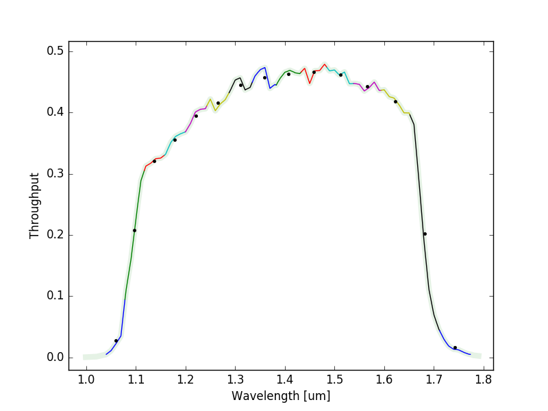

# Introduction

[](https://github.com/hover2pi/svo_filters/actions/workflows/svo_filters_workflow.yml)
[](https://coveralls.io/github/hover2pi/svo_filters?branch=master&service=github)
[](https://svo_filters.readthedocs.io/en/latest/?badge=latest)

The [Spanish Virtual Observatory (SVO) Filter Profile Service](http://svo2.cab.inta-csic.es/theory/fps3/) is a great resource for homogenized photometric filter curves and metadata. With `svo_filters`, I tried to create a lightweight and flexible package to incorporate these filters into Python applications.

Install via PyPI with

```
pip install svo_filters
```

Or install via Github with

```
git clone https://github.com/hover2pi/svo_filters.git
python svo_filters/setup.py install
```

Then import like so

```python
from svo_filters import svo
```

The actual filters are stored locally as XML files and can be viewed with


```python
svo.filters()
```
```
       Band                                        CalibrationReference                                    FWHM   Facility  FilterProfileService ...  wl_max   wl_min  Instrument
      str91                                               str86                                          float64   str91           str91         ... float64  float64    str91   
----------------- -------------------------------------------------------------------------------------- ------- ---------- -------------------- ... -------- -------- ----------
          2MASS.H http://adsabs.harvard.edu/cgi-bin/nph-bib_query?bibcode=2003AJ....126.1090C&db_key=AST 0.26096      2MASS        ivo://svo/fps ...   1.8231  1.47874         --
          2MASS.J            http://adsabs.harvard.edu/cgi-bin/nph-bib_query?bibcode=2003AJ....126.1090C 0.21491      2MASS        ivo://svo/fps ...   1.4068  1.08065         --
         2MASS.Ks            http://adsabs.harvard.edu/cgi-bin/nph-bib_query?bibcode=2003AJ....126.1090C 0.27846      2MASS        ivo://svo/fps ...  2.35524  1.95437         --
    ACS_HRC.F435W                                                                                     -- 0.08852        HST        ivo://svo/fps ...  0.48613   0.3599        ACS
    ACS_HRC.F555W                                                                                     --   0.123        HST        ivo://svo/fps ...  0.62049  0.45867        ACS
    ACS_HRC.F658N                                                                                     --  0.0072        HST        ivo://svo/fps ...  0.66594  0.65099        ACS
    ACS_HRC.F775W                                                                                     -- 0.15151        HST        ivo://svo/fps ...  0.86307  0.68014        ACS
   ACS_HRC.F850LP                                                                                     -- 0.15317        HST        ivo://svo/fps ...  1.09465  0.80151        ACS
        Cousins.I                                                                                     -- 0.10937         --        ivo://svo/fps ...  0.90006  0.70665         --
        Cousins.R                                                                                     -- 0.15165         --        ivo://svo/fps ...    0.795     0.55         --
       FourStar.J                                                                                     -- 0.22829        LCO        ivo://svo/fps ...  1.37261  1.10964   FourStar
      FourStar.J1                                                                                     -- 0.09882        LCO        ivo://svo/fps ...  1.12095   0.9908   FourStar
      FourStar.J2                                                                                     -- 0.13685        LCO        ivo://svo/fps ...  1.23809  1.06006   FourStar
      FourStar.J3                                                                                     -- 0.13998        LCO        ivo://svo/fps ...  1.37794  1.20031   FourStar
          Gaia.bp                                                                                     -- 0.24832       GAIA        ivo://svo/fps ...  0.67089  0.32793       GAIA
           Gaia.G                                                                                     -- 0.45783       GAIA        ivo://svo/fps ...  1.08275  0.33212       GAIA
          Gaia.rp                                                                                     -- 0.31164       GAIA        ivo://svo/fps ...  1.06083  0.61768       GAIA
        GALEX.FUV                                                                                     -- 0.02278      GALEX        ivo://svo/fps ...  0.18064  0.13403         --
        GALEX.NUV                                                                                     -- 0.07956      GALEX        ivo://svo/fps ...  0.30067  0.16925         --
          IRAC.I1                                                                                     -- 0.74317    Spitzer        ivo://svo/fps ...  3.96144  3.12962       IRAC
          IRAC.I2                                                                                     -- 1.00968    Spitzer        ivo://svo/fps ...  5.05606  3.91733       IRAC
              ...                                                                                    ...     ...        ...                  ... ...      ...      ...        ...
            PS1.r                                                                                     -- 0.14044 PAN-STARRS        ivo://svo/fps ...  0.70357  0.53862 PAN-STARRS
            PS1.y                                                                                     -- 0.06282 PAN-STARRS        ivo://svo/fps ...  1.08385  0.91005 PAN-STARRS
            PS1.z                                                                                     -- 0.10343 PAN-STARRS        ivo://svo/fps ...   0.9346   0.8028 PAN-STARRS
           SDSS.g                                               www.sdss.org/DR2/algorithms/fluxcal.html 0.12627      SLOAN        ivo://svo/fps ...  0.55493  0.37825         --
           SDSS.i                                               www.sdss.org/DR2/algorithms/fluxcal.html 0.12389      SLOAN        ivo://svo/fps ...  0.83895  0.66895         --
           SDSS.r                                               www.sdss.org/DR2/algorithms/fluxcal.html 0.11495      SLOAN        ivo://svo/fps ...  0.69891  0.54153         --
           SDSS.u                                               www.sdss.org/DR2/algorithms/fluxcal.html 0.05823      SLOAN        ivo://svo/fps ...  0.40282  0.30483         --
           SDSS.z                                               www.sdss.org/DR2/algorithms/fluxcal.html 0.09944      SLOAN        ivo://svo/fps ...  1.08333  0.79604         --
    WFC3_IR.F125W                                                                                     -- 0.30052        HST        ivo://svo/fps ...  1.41392  1.08446       WFC3
     WFC3_IR.G102                                                                                     -- 0.57288        HST        ivo://svo/fps ...  1.77466  1.04039       WFC3
     WFC3_IR.G141                                                                                     -- 0.57288        HST        ivo://svo/fps ...  1.77466  1.04039       WFC3
 WFC3_UVIS2.F814W                                                                                     -- 0.15047        HST        ivo://svo/fps ...  0.96836  0.69782       WFC3
WFC3_UVIS2.F850LP                                                                                     --  0.1168        HST        ivo://svo/fps ...  1.09224  0.82505       WFC3
      WFPC2.F336W                                                                                     -- 0.04909        HST        ivo://svo/fps ...  0.37903  0.29565      WFPC2
      WFPC2.F439W                                                                                     -- 0.07058        HST        ivo://svo/fps ...  0.47581  0.38935      WFPC2
      WFPC2.F656N                                                                                     -- 0.00285        HST        ivo://svo/fps ...  0.65874  0.65384      WFPC2
      WFPC2.F814W                                                                                     -- 0.25562        HST        ivo://svo/fps ...  1.00426  0.69476      WFPC2
         Wircam.Y                                                                                     -- 0.11053       CFHT        ivo://svo/fps ...   1.1134   0.9386     Wircam
          WISE.W1         http://wise2.ipac.caltech.edu/docs/release/prelim/expsup/figures/sec4_3gt4.gif 0.63579       WISE        ivo://svo/fps ...  3.87239   2.7541         --
          WISE.W2         http://wise2.ipac.caltech.edu/docs/release/prelim/expsup/figures/sec4_3gt4.gif 1.10732       WISE        ivo://svo/fps ...  5.34136  3.96333         --
          WISE.W3         http://wise2.ipac.caltech.edu/docs/release/prelim/expsup/figures/sec4_3gt4.gif  6.2758       WISE        ivo://svo/fps ... 17.26134  7.44304         --
          WISE.W4         http://wise2.ipac.caltech.edu/docs/release/prelim/expsup/figures/sec4_3gt4.gif 4.73973       WISE        ivo://svo/fps ... 27.91072 19.52008         --
```

# Load a Photometric Filter

To load a filter object, just pass the band name to the `Filter` class. We can then view the metadata and see a plot!


```python
H_band = svo.Filter('2MASS.H')
H_band.info()
H_band.plot()
```

```
     Attributes                                              Values                                        
-------------------- --------------------------------------------------------------------------------------
                Band H                                                                                     
CalibrationReference http://adsabs.harvard.edu/cgi-bin/nph-bib_query?bibcode=2003AJ....126.1090C&db_key=AST
                FWHM 0.26096                                                                               
            Facility 2MASS                                                                                 
FilterProfileService ivo://svo/fps                                                                         
              MagSys Vega                                                                                  
           PhotCalID 2MASS/2MASS.H/Vega                                                                    
          PhotSystem 2MASS                                                                                 
    ProfileReference http://www.ipac.caltech.edu/2mass/releases/allsky/doc/sec6_4a.html                    
       WavelengthCen 1.64872                                                                               
       WavelengthEff 1.662                                                                                 
       WavelengthMax 1.8231                                                                                
      WavelengthMean 1.662                                                                                 
       WavelengthMin 1.47874                                                                               
      WavelengthPeak 1.671                                                                                 
      WavelengthPhot 1.64238                                                                               
     WavelengthPivot 1.64949                                                                               
       WavelengthUCD em.wl                                                                                 
      WavelengthUnit um                                                                                    
            WidthEff 0.25094                                                                               
           ZeroPoint 1.1113698753332439e-10                                                                
       ZeroPointType Pogson                                                                                
       ZeroPointUnit erg / (Angstrom cm2 s)                                                                
            filterID 2MASS/2MASS.H                                                                         
              n_bins 1                                                                                     
                path /Users/jfilippazzo/Documents/Modules/svo_filters/svo_filters/data/filters/2MASS.H     
      pixels_per_bin 58                                                                                    
                refs ['AST']                                                                               
              wl_max 1.8231                                                                                
              wl_min 1.47874                                                                               
```


The actual relative spectral response curve is stored as an array of the wavelength and throughput.


```python
H_band.rsr.shape
```
    (2, 58)


# Load a Grism

Filters can also be binned arbitrarily, for use with grisms. We can pass integers to the `n_bins` or `pixels_per_bin` arguments to specify the number of wavelength bins or pixels per bin, respectively.


```python
G141 = svo.Filter('WFC3_IR.G141', n_bins=15)
G141.info()
G141.plot()
```

```
     Attributes                                              Values                                        
-------------------- --------------------------------------------------------------------------------------
                FWHM 0.57288                                                                               
            Facility HST                                                                                   
FilterProfileService ivo://svo/fps                                                                         
          Instrument WFC3                                                                                  
              MagSys Vega                                                                                  
           PhotCalID HST/WFC3_IR.G141/Vega                                                                 
          PhotSystem WFC3                                                                                  
    ProfileReference http://www.stsci.edu/hst/wfc3/documents/handbooks/currentIHB/                         
       WavelengthCen 1.38902                                                                               
       WavelengthEff 1.32829                                                                               
       WavelengthMax 1.77466                                                                               
      WavelengthMean 1.39879                                                                               
       WavelengthMin 1.04039                                                                               
      WavelengthPeak 1.48039                                                                               
      WavelengthPhot 1.3481                                                                                
     WavelengthPivot 1.38869                                                                               
       WavelengthUCD em.wl                                                                                 
      WavelengthUnit um                                                                                    
            WidthEff 0.52172                                                                               
           ZeroPoint 2.2612502006498423e-10                                                                
       ZeroPointType Pogson                                                                                
       ZeroPointUnit erg / (Angstrom cm2 s)                                                                
            filterID HST/WFC3_IR.G141                                                                      
              n_bins 15                                                                                    
                path /Users/jfilippazzo/Documents/Modules/svo_filters/svo_filters/data/filters/WFC3_IR.G141
      pixels_per_bin 580                                                                                   
                refs []                                                                                    
              wl_max 1.77466                                                                               
              wl_min 1.04039  
```





Now we can apply our filter to a spectrum like so


```python
# Get the filter object
import numpy as np
G141 = svo.Filter('WFC3_IR.G141', n_bins=15)

# Get a spectrum
file = resource_filename('svo_filters', 'data/spectra/vega.txt')
spec = np.genfromtxt(file)

# Applyt the filter
filtered = G141.apply(spec, plot=True)
```


Filters are fun!

## Licensed

This project is Copyright (c) Joe Filippazzo and licensed under the terms of the BSD 3-Clause license. See the licenses folder for more information.

[](http://www.astropy.org)
